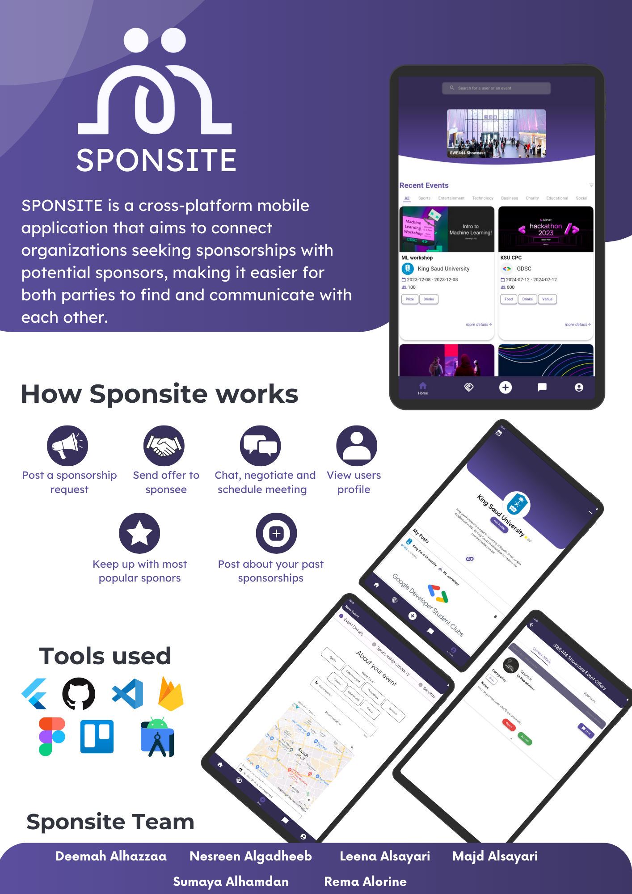

# Sponsite

Sponsite is a cross-platform mobile application aims to connect organizations seeking sponsorships with potential sponsors. By providing a platform for sponsees to announce their sponsorship needs and sponsors to showcase their capabilities, Sponsite eliminates the challenges and difficulties associated with finding and securing sponsorships.

Furthermore, Sponsite goes beyond just connecting sponsees and sponsors. It also helps in managing the entire sponsorship process, offering features such as chat functionality, scheduling online meetings, rating your experience, posting about your experience and personal profiles. This comprehensive approach ensures that all aspects of the sponsorship process are streamlined and efficient.

# Tools
Flutter, Firebase, Google Calendar API

